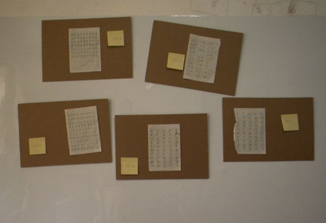
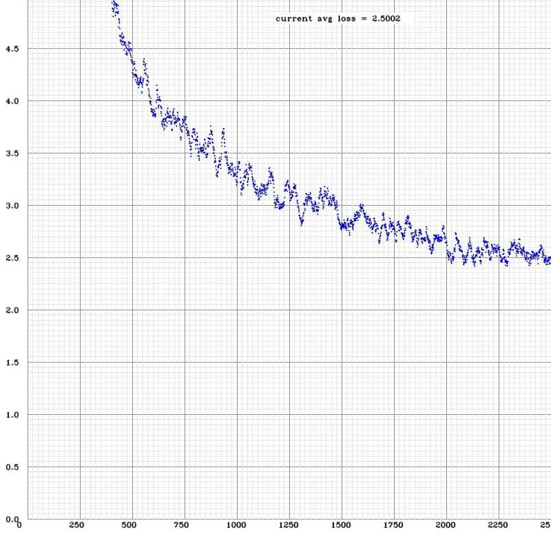
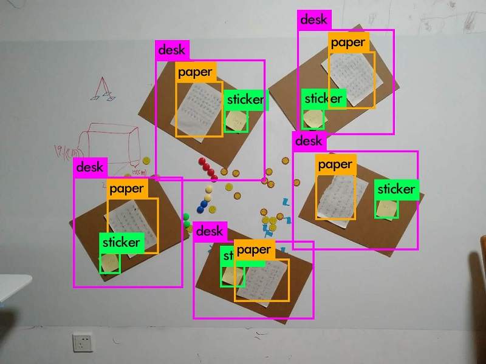

# YOLO迁移学习demo

## 背景
有个项目需要对俯视视角拍摄的照片中的课桌桌面以及课桌桌面上的纸质文档识别定位，为了验证可行性，先构建了如下图所示的实验样本



黄色的纸板模拟课桌桌面，每个“桌面”上有一张纸和一张便利贴，这样总共需要识别的目标类型有三类，分别是desk、paper和sticker。

## 一、数据准备
调整“课桌”的位置和旋转角度拍了80个样本，使用 https://github.com/AlexeyAB/Yolo_mark 对样本打标签，80个样本忙乎了大半天累了个够呛！由于yolo建议最小mini batch size不小于64，故又从已经打好标签的样本中选择了28个样本复制凑够2个mini batch共128个样本的training set。validate set 干脆懒得做了，直接用traning set当 validate set。数据在 ./train/data 目录下。打完标签后逐个样本仔细检查了一遍，还真发现了几处错误，因为样本太少，无论是漏了目标还是目标分错类了，后果都将会是很严重的！

这么少的样本能不能凑效心里还真是没底，记得上deeplearning.ai课程做过一个检测人脸happy还是不happy的编程作业，那个作业的training set有1000个样本，但不是做迁移学习，而本demo的traning set有80个图片，每个图片有5个重复的目标，也就是说每个分类有80*5=400个样本，做迁移学习也许能行，试试看呗！


## 二、配置参数
darknet官方网站对如何更改.cfg文件来进行迁移学习没有做详细说明，好在 https://github.com/AlexeyAB/darknet 做了较为详尽的解说，给了我很大的帮助。

参数设置思路如下：
- 首先因为本demo的任务只需要对3类目标进行检测和定位，选用tiny模型就够了，即在yolov3-tiny.cfg配置文件的基础上修改配置。

- 因为有128个样本，而darknet建议batch size 至少为64，所以 设置 **batch=64**。

- **subdivisions** 这个参数意义是将每个mini-batch 分成多少份进行处理，显存越小这个数越大，我的GeForce 940MX 显卡只有2G显存，设置 **subdivisions=16** 没有报告out of memory，显卡每次加载64/16=4个样本进行计算。

- 样本的分辨率为1280 * 1024， 为了加快训练速度，设置 **width=640**, **height=512**，即分辨率减半。

- **burn_in** 这个参数的默认值是1000，如果没有GPU会比较坑人，分析源码发现其意义是对模型做预热，你训练了半天发现learning rate一直是0，因为当epoch < burin_in 时，实际learning rate 会乘上一个系数pow(epoch/burin_in, 4)，也就是说500个epoch的时候learning rate才到实际设置值的1/16，基本上前面几百个epoch模型就是在空转！因为这个demo是做迁移学习，不需要预热，**burn_in=0** 就ok。

- anchors这个参数不能用默认值，必须与目标的尺寸保持一致，对训练集运行命令
```
 darknet detector calc_anchors data/obj.data -num_of_clusters 3 -width 640 -height 512
 ```
 得到与3类目标匹配的3组box size **anchors=29.2225,29.6818, 64.6086,69.0085, 138.8812,129.0774** 需要说明的是width和height必须与前面的设置保持一致。

- mask这个参数用于指示yolo输出层检测哪几个与anchor box匹配的目标。yolo为了提高小目标的检测精度，借鉴了ResNet 和GoogleNet，将浅层的feature走捷径连接到深层，并且使用多个yolo输出层，tiny模型使用了2个yolo输出层，第一个yolo输出层 **mask=1,2** ，第二个yolo输出层 **mask=0** 。

- 设置yolo层相邻前一层卷积层的filters参数，上过deeplearning.ai课程或者读懂了YOLO paper的同学比较容易理解，这个filter实际就是样本对应的输出向量Y的维数，filters=(目标分类个数+目标坐标个数+目标概率)\*mask个数，因此与第一个yolo层匹配的filters=(3+4+1)\*2=16， 与第二个yolo层匹配的filters=(3+4+1)\*1=8。

- 设置random参数，**random=1** 在训练的过程中图像会被随机的缩放，也就是数据增强，它会降低学习速度，但提高模型的泛化能力。

- 设置stopbackward，这个参数的设置非常关键， **stopbackward=0** 意味着每个mini batch更新整个网络的可学习参数，也就是在此前训练的基础上fine tune，**stopbackward=1** 意味着它所在的层之前的参数全固定，也就是transfer learning了。实测结果表明，使用fine tune，loss降低得非常快，使用transfer learning loss降低得慢些，但训练的速度要快很多，最终的loss能降到更低的水平，理论上泛化效果也会更好。可以将 **stopbackward=1** 放在深浅不同的层，等效于在fine tune和transfer learning之间做trade off。

- 获取预训练参数。先从darknet官网下载yolo-tiny-v3的预训练权重文件 https://pjreddie.com/media/files/yolov3-tiny.weights 执行命令 **darknet partial yolov3-tiny.cfg yolov3-tiny.weights yolov3-tiny.conv.15 15** 提取前15层的权重。

其它参数保持缺省值不变，完整的配置参考 [yolov3-tiny-demo.cfg](./train/yolov3-tiny-demo.cfg)

## 三、训练模型
完成训练样本与配置文件的准备后，仔细检查确认无误就可以执行下面的命令开始训练了
```
darknet detector train data/obj.data yolov3-tiny-demo.cfg yolov3-tiny.conv.15
```
训练到2400个epoch时，输出结果如下：
```
Region 16 Avg IOU: 0.756506, Class: 0.923809, Obj: 0.620680, No Obj: 0.009392, .5R: 0.909091, .75R: 0.727273,  count: 22
Region 23 Avg IOU: 0.785760, Class: 0.992535, Obj: 0.685602, No Obj: 0.002840, .5R: 0.928571, .75R: 0.785714,  count: 14
Region 16 Avg IOU: 0.842507, Class: 0.999220, Obj: 0.819550, No Obj: 0.015101, .5R: 1.000000, .75R: 0.960000,  count: 25
Region 23 Avg IOU: 0.837215, Class: 0.999310, Obj: 0.811453, No Obj: 0.003064, .5R: 1.000000, .75R: 0.833333,  count: 12
Region 16 Avg IOU: 0.782034, Class: 0.953179, Obj: 0.805774, No Obj: 0.014905, .5R: 0.911765, .75R: 0.735294,  count: 34
Region 23 Avg IOU: 0.756312, Class: 0.942257, Obj: 0.872470, No Obj: 0.003650, .5R: 0.937500, .75R: 0.687500,  count: 16
Region 16 Avg IOU: 0.843064, Class: 0.997197, Obj: 0.817189, No Obj: 0.012141, .5R: 1.000000, .75R: 0.909091,  count: 22
Region 23 Avg IOU: 0.782405, Class: 0.926993, Obj: 0.779562, No Obj: 0.003448, .5R: 0.923077, .75R: 0.846154,  count: 13
Region 16 Avg IOU: 0.836928, Class: 0.999098, Obj: 0.847587, No Obj: 0.018383, .5R: 1.000000, .75R: 0.925000,  count: 40
Region 23 Avg IOU: 0.779768, Class: 0.988549, Obj: 0.872948, No Obj: 0.004522, .5R: 0.950000, .75R: 0.700000,  count: 20
Region 16 Avg IOU: 0.777036, Class: 0.905402, Obj: 0.605053, No Obj: 0.012214, .5R: 0.937500, .75R: 0.718750,  count: 32
Region 23 Avg IOU: 0.760443, Class: 0.941166, Obj: 0.710328, No Obj: 0.003090, .5R: 0.928571, .75R: 0.714286,  count: 14
Region 16 Avg IOU: 0.832402, Class: 0.998476, Obj: 0.743796, No Obj: 0.014533, .5R: 1.000000, .75R: 0.833333,  count: 24
Region 23 Avg IOU: 0.821967, Class: 0.999673, Obj: 0.842426, No Obj: 0.003047, .5R: 1.000000, .75R: 1.000000,  count: 10
Region 16 Avg IOU: 0.858386, Class: 0.989282, Obj: 0.870355, No Obj: 0.021301, .5R: 1.000000, .75R: 0.950000,  count: 40
Region 23 Avg IOU: 0.820351, Class: 0.999239, Obj: 0.887590, No Obj: 0.004509, .5R: 1.000000, .75R: 0.900000,  count: 20
Region 16 Avg IOU: 0.839844, Class: 0.992170, Obj: 0.780179, No Obj: 0.015117, .5R: 1.000000, .75R: 0.937500,  count: 32
Region 23 Avg IOU: 0.798583, Class: 0.989847, Obj: 0.898876, No Obj: 0.003661, .5R: 1.000000, .75R: 0.714286,  count: 14
Region 16 Avg IOU: 0.878050, Class: 0.997964, Obj: 0.831928, No Obj: 0.019663, .5R: 1.000000, .75R: 0.972973,  count: 37
Region 23 Avg IOU: 0.810988, Class: 0.999695, Obj: 0.862338, No Obj: 0.004156, .5R: 1.000000, .75R: 0.823529,  count: 17
Region 16 Avg IOU: 0.838597, Class: 0.984408, Obj: 0.829183, No Obj: 0.019762, .5R: 0.975000, .75R: 0.850000,  count: 40
Region 23 Avg IOU: 0.812428, Class: 0.998835, Obj: 0.774572, No Obj: 0.004120, .5R: 1.000000, .75R: 0.850000,  count: 20
Region 16 Avg IOU: 0.820446, Class: 0.980475, Obj: 0.761073, No Obj: 0.016481, .5R: 1.000000, .75R: 0.894737,  count: 38
Region 23 Avg IOU: 0.756637, Class: 0.994415, Obj: 0.801270, No Obj: 0.003432, .5R: 0.933333, .75R: 0.800000,  count: 15
Region 16 Avg IOU: 0.858977, Class: 0.998471, Obj: 0.850159, No Obj: 0.018785, .5R: 1.000000, .75R: 0.925000,  count: 40
Region 23 Avg IOU: 0.827125, Class: 0.999706, Obj: 0.868081, No Obj: 0.004593, .5R: 1.000000, .75R: 0.900000,  count: 20
Region 16 Avg IOU: 0.780378, Class: 0.953309, Obj: 0.817178, No Obj: 0.017667, .5R: 0.923077, .75R: 0.666667,  count: 39
Region 23 Avg IOU: 0.787021, Class: 0.985617, Obj: 0.751813, No Obj: 0.004460, .5R: 1.000000, .75R: 0.714286,  count: 21
Region 16 Avg IOU: 0.788178, Class: 0.963674, Obj: 0.682921, No Obj: 0.010949, .5R: 0.964286, .75R: 0.750000,  count: 28
Region 23 Avg IOU: 0.750215, Class: 0.977657, Obj: 0.695747, No Obj: 0.003015, .5R: 1.000000, .75R: 0.437500,  count: 16
Region 16 Avg IOU: 0.833225, Class: 0.964787, Obj: 0.819942, No Obj: 0.017004, .5R: 1.000000, .75R: 0.857143,  count: 35
Region 23 Avg IOU: 0.795411, Class: 0.972966, Obj: 0.793855, No Obj: 0.003874, .5R: 0.937500, .75R: 0.812500,  count: 16

 2400: 2.657342, 2.331566 avg loss, 0.000010 rate, 4.455893 seconds, 153792 images
```
对于每个分类目标实际只有400个样本的训练集，看起来效果还算可以。loss函数输出曲线：




## 四、测试结果
训练样本是用一个工业相机拍的，亮度偏低，为了验证模型的泛化效果，特意用手机加大曝光拍摄了几个测试样本，测试效果如下：
```
test.jpg: Pr: Predicted in 0.031242 seconds.
desk: 91%
sticker: 93%
paper: 62%
desk: 88%
paper: 58%
desk: 94%
sticker: 43%
sticker: 82%
paper: 96%
desk: 54%
desk: 53%
sticker: 36%
paper: 35%
paper: 40%
sticker: 76%
```
泛化效果不是很理想，右上角的desk的IOU明显偏低，We need more data！


